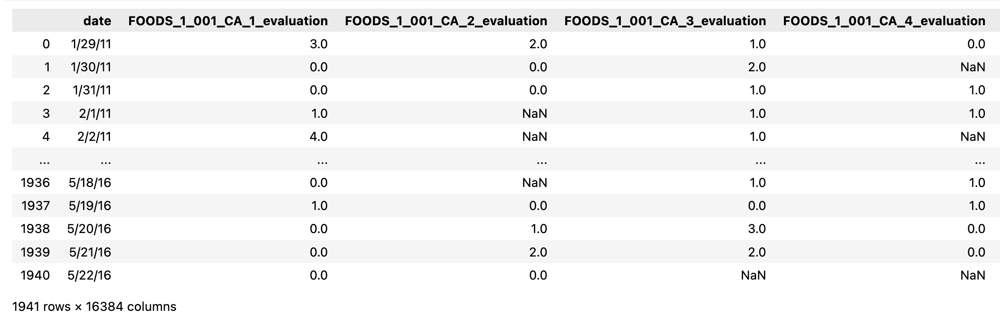
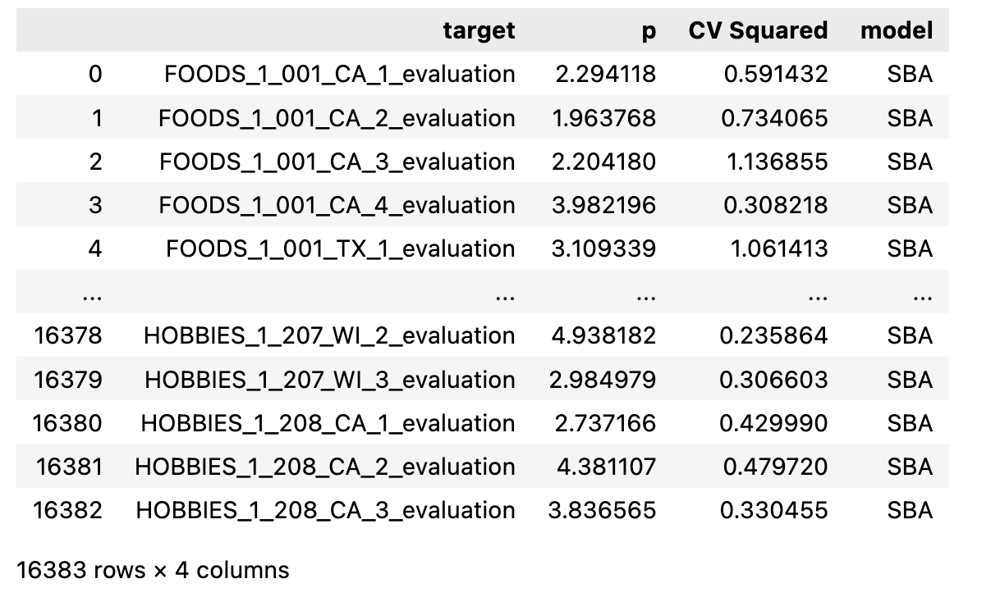
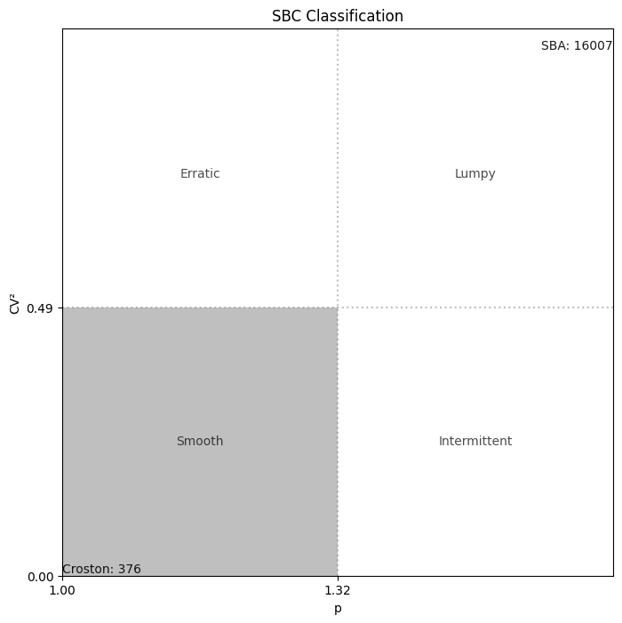
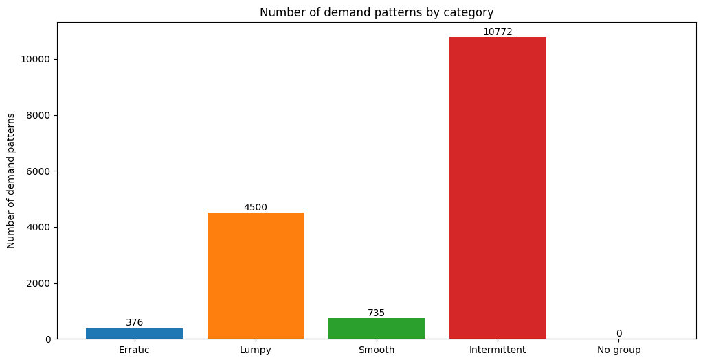

# Demand Patterns SBC (Syntetos Boylan Croston) method of Categorizations

## Description
This method helps classify different demand patterns (time-series patterns) into groups in order to fit the most appropriate model. More info could be found [here](https://www.researchgate.net/publication/28578603_On_the_categorization_of_demand_patterns) and [here](https://robjhyndman.com/papers/SBC-categorization.pdf) 

This is a Python version of the tsintermittent package in R. At the moment, only the SBC method is available.

## Installation
`pip install sbc-classification`


## Example
### Test Data

Test data is the clean version of the data from M5 Forecasting Challenge competition on Kaggle. Details can be found [here](https://www.kaggle.com/competitions/m5-forecasting-accuracy/data). The dataset was processed to make it easier to test the function.

<div style="width:85%; margin:0 auto">
   
</div>
<br>


### Testing
<b>Note:</b> This function will not treat NA values. All the null values in the time-series should be treated separately.

```python
from sbc import sbc_class.sbc_class

df = pd.read_csv("./tests/data/sales_train_clean.csv")
## multiple targets
out = sbc_class.(df.iloc[:, 1:], plot_type = 'summary')
## 1 target
out1 = sbc_class.(df.iloc[:, 1], plot_type = 'summary')

print(out)
print(out1)
```

If plot_type is not None, output would be a plot and a dataframe of target_name, p, CV squared and classified model type for multiple targets 

<div style="width:85%; margin:0 auto">
   
</div>
<br>

If plot_type is `summary` then the plot would be a matrix diagram of numbers of time-series in each category 

<div style="width:85%; margin:0 auto">
   
</div>
<br>

If plot_type is `bar` then the plot would be bar chart of numbers of time-series in each demand patterns 

<div style="width:85%; margin:0 auto">
   
</div>
<br>

Please give the package a star if you find it helpful :)